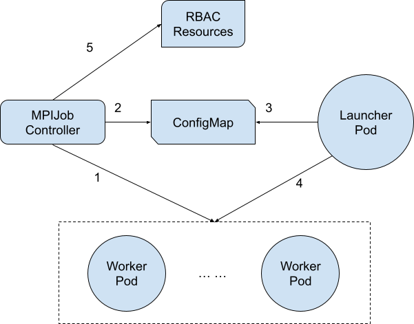

- [Motivation](#motivation)
- [Goals](#goals)
- [API](#api)
- [Design](#design)
- [Alternatives Considered](#alternatives-considered)
  
## Motivation
With the introduction of Elastic Horovod, the allreduce-styled framework for distributed-data-parallel training is capable of dynamically modifying the number of worker instances within one training task. Such a feature enables an mpi-job to brace failure of worker pods during an experiment without checkpoint, as well as release/absorb resources under various conditions.

However, the contemporary design of mpi-operator does not provide necessary information update to the launcher for elastic training. With the enhancement of mpi-operator to handle replicas change or pod failure, we are expecting to support Elastic Horovod in mpi-jobs.

## Goals
* Remove worker Pods when worker replicas is scaled less than the count of current worker Pods
* Provide a mpi-operator-specific `discover_hosts.sh` for [Elastic Horovod](https://docs.google.com/document/d/15ZoHA5AeSI_boeyIBapg9WPXKrYXMRvPytPzQWTCTn4/edit#) to discover available running workers.

## API
There are no API changes to MPIJobs. Users who prefer non-elastic mode can simply ignore the `discover_hosts.sh` script.

## Design
We introduce multiple modifications to the mpi-controller to offer an mpi-job-specific `disocver_hosts.sh` script, which Elastic Horovod uses for available worker spotting and task launching:
1. The MPIJob Controller listens for pods, listing all worker pods with running phase
2. Add a new entry of `discover_hosts.sh` to the ConfigMap, which converts the list of running worker pods into a script following the format defined in Elastic Horovod [Doc](https://horovod.readthedocs.io/en/stable/elastic_include.html)
3. The `discover_hosts.sh` is mapped under `/etc/mpi/`, where the ConfigMap is mounted on the launcher pod
4. Command `horovodrun` in the launcher pod uses `/etc/mpi/discover_hosts.sh` to spot available hosts and use `kubectl` to launch work process on newly created worker pods
5. The MPIJob Controller updates the rule in RBAC resources as well, enabling launcher pod to launch new worker process on newly created worker pods
  

There remains some delay in the `discover_hosts.sh` script when reflecting the phases of worker pods. However, that should not affect the overall performance of elastic training, as the delay can be ignored compared with the elapsed training time.

Another modification to the MPIJob controller is how to handle the situation when the worker replicas number is scaled less than the worker pods created. Before the modification, the controller only creates more worker pods when replicas increase and stays irrelevant when decreases. We propose to delete worker pods whose trailing index in the pod name is beyond the contemporary worker replicas count.

## Alternatives Considered
Instead of logging running worker pods into a script by the controller and delivering the updated list to the launcher pod, another approach is to use the `kubectl` in launcher pod to list all running worker pods every time when `discover_hosts.sh` is executed. However, this exposes a potential threat to the performance of Kubernetes as the execution may be too frequent.
